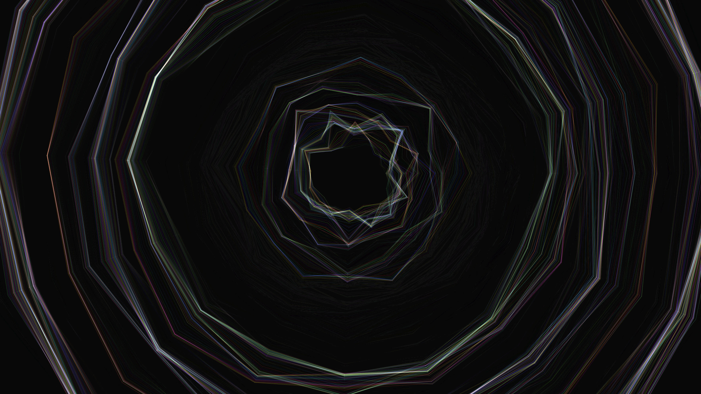

# Prism
**We can see the bigger picture only if we focus.**

The beams of light coming from the center represent everything that we see around us. In order to understand the complexity of our world, we need to maintain appropriate focus. Only then we can start to see the connections.

This artwork simulates a combination of colors of the spectrum into white, similarly to Newton's prism experiments. The visuals are created interactively using the eye gaze of the spectator.

## Description & usage

Upon first start, the system needs to learn spectator's eyes. Stare at each corner of the screen, at the middle between every corner, and lastly to the center of the screen. While staring, click at least 5 times in the place. Stare at the cursor.

Then use "d" key to hide UI and "f" to fully immerse in the experience.

## Visuals

Concentric circles of every color hue are emanating from the center of the view, and infinitely expand. When many circles meet, they blend their color together, creating white. When user looks at the center, the speed of the circles decreases, and the stability of the circles increases - which, in turn focuses all colors and turns them into white. When the user looses their focus, and looks elsewhere, the circles rapidly grow, loosing the visuals.

The concentric circles, as a central element, work to create immersion.

## Technology used

Using the libraries P5.js and WebGazer.js. A standard web camera is tracking eye gaze of the spectator.
